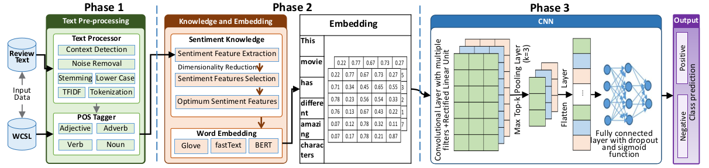
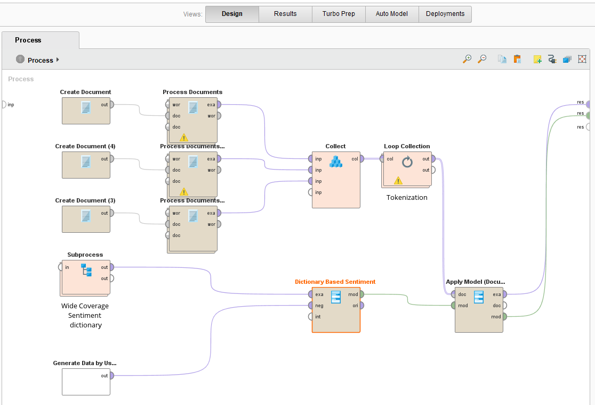
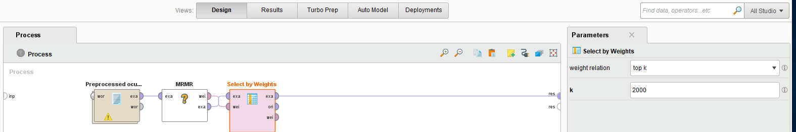
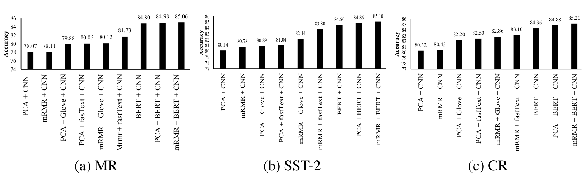

# Leveraging-semantic-and-sentiment-knowledge-for-DNN-based-sentiment-classification


# Model Architecture:
<p align="center">

</p>


# Data preparation:

### Sentiment feature extraction by WCSL

<p align="center">
    
</p>

### Feature selection top k

<p align="center">
    
</p>


# Environmental Setup:

```
- python==3.7
- pip install keras-bert
- pip install keras-rectified-adam
- pip install tensorflow==2.2.0
- pip install keras==2.3.1
```
# Results:

<p align="center">
    
</p>
